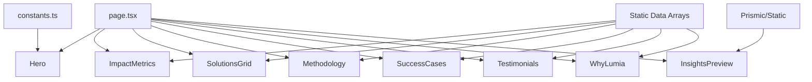

# Technical Specification — Lumia Home Page Refresh

## Executive Summary

This specification details the front-end implementation of the Lumia home page refresh, focusing on conversion optimization, brand reinforcement, and mobile-first accessibility. The solution leverages the existing Next.js/Tailwind codebase and design system, modifying existing components and creating new ones as needed.

Key architectural decisions include: using lightweight Framer Motion for scroll-triggered animations (with reduced-motion fallbacks), modifying the existing `Hero.tsx` in place, implementing both carousel and stacked layouts for testimonials/cases to allow future selection, and centralizing WhatsApp CTA configuration in `constants.ts`. All new components follow the established patterns using `tailwind-variants`, `GlassCard`, and existing design tokens.

## System Architecture

### Component Overview

```
src/app/(marketing)/
├── page.tsx                          # Updated section order
└── components/home/
    ├── Hero.tsx                      # MODIFY - new headline, dual CTAs, scroll cue
    ├── ImpactMetrics.tsx             # MODIFY - new metrics data, icon support
    ├── SolutionsGrid.tsx             # NEW - 3-card grid with brand styling
    ├── Methodology.tsx               # MODIFY - add illustration, animated timeline
    ├── SuccessCases.tsx              # NEW - carousel + stacked variants
    ├── Testimonials.tsx              # NEW - carousel + stacked variants
    ├── WhyLumia.tsx                  # NEW - 3 value cards
    ├── InsightsPreview.tsx           # NEW - blog preview (replaces BlogPreview)
    └── hooks/
        └── useScrollProgress.ts      # NEW - scroll animation hook
```

### Data Flow



## Implementation Design

### Main Interfaces

```typescript
// types/home.ts
export interface IMetricCard {
  id: number
  value: string
  label: string
  icon: LucideIcon
}

export interface ISolutionCard {
  title: string
  description: string
  href: string
  icon: LucideIcon
}

export interface IMethodologyStep {
  id: number
  title: string
  description: string
  diferencial: string
  icon: LucideIcon
}

export interface ICaseStudy {
  id: number
  clientName: string
  logoAlt: string
  badge: string
  challenge: string
  action: string
  result: string
  href?: string
}

export interface ITestimonial {
  id: number
  quote: string
  highlight: string
  authorName: string
  authorRole: string
  authorCompany: string
  authorImage: string
}

export interface IValueCard {
  id: number
  title: string
  description: string
  icon: LucideIcon
}

export interface IBlogPreview {
  id: string
  title: string
  category: string
  date: string
  image?: string
  href: string
}
```

### Data Models

#### constants.ts Updates

```typescript
// src/shared/config/constants.ts
export const CONTACT_INFO = {
  whatsapp: {
    number: '5511947305880',
    display: '(11) 94730-5880',
    // Updated with preset message (URL-encoded)
    link: 'https://wa.me/5511947305880?text=Ol%C3%A1%2C%20Lumia!%20Acabei%20de%20visitar%20o%20site%20de%20voc%C3%AAs%20e%20tenho%20interesse%20em%20conversar%20sobre%20conformidade%20ambiental%20para%20minha%20empresa.%20Podem%20me%20ajudar%3F',
    presetMessage:
      'Olá, Lumia! Acabei de visitar o site de vocês e tenho interesse em conversar sobre conformidade ambiental para minha empresa. Podem me ajudar?',
  },
  email: 'contato@lumia.com.br',
}
```

#### Static Data Arrays (in respective components)

```typescript
// Metrics data (ImpactMetrics.tsx)
const metrics: IMetricCard[] = [
  { id: 1, value: '15+', label: 'Especialistas técnicos', icon: Users },
  { id: 2, value: '280+', label: 'Clientes em conformidade', icon: Building2 },
  {
    id: 3,
    value: '1.200+',
    label: 'Processos administrativos gerenciados',
    icon: FileCheck,
  },
  { id: 4, value: '98%', label: 'Satisfação dos clientes', icon: ThumbsUp },
]

// Solutions data (SolutionsGrid.tsx)
const solutions: ISolutionCard[] = [
  {
    title: 'Licenciamento Ambiental para Indústrias',
    description:
      'Obtenha e renove suas licenças (LP, LI, LO) com agilidade e segurança jurídica para operar sem interrupções.',
    href: '/solutions/licenciamento-industrial',
    icon: Factory,
  },
  // ... 2 more cards
]
```

## Integration Points

### Framer Motion (Animation Library)

**Installation:**

```bash
pnpm add framer-motion
```

**Usage Strategy:**

- Use `motion` components only where scroll animations are required (Methodology timeline)
- Implement `LazyMotion` with `domAnimation` features for reduced bundle size
- Respect `prefers-reduced-motion` via Framer's built-in support

```typescript
// Lightweight import pattern
import { LazyMotion, domAnimation, m } from 'framer-motion'

// Wrap animated sections only
<LazyMotion features={domAnimation}>
  <m.div
    initial={{ opacity: 0 }}
    whileInView={{ opacity: 1 }}
    viewport={{ once: true, margin: '-100px' }}
  >
    {/* content */}
  </m.div>
</LazyMotion>
```

### Image Assets

| Asset             | Path                            | Usage                               |
| ----------------- | ------------------------------- | ----------------------------------- |
| Operating Diagram | `/images/operating_diagram.svg` | Methodology section illustration    |
| Pattern 1         | `/images/pattern_1.svg`         | Hero/section backgrounds (optional) |
| Pattern 2         | `/images/pattern_2.svg`         | Card accents                        |
| Pattern 3         | `/images/pattern_3.svg`         | Footer/CTA backgrounds              |

## Testing Approach

### Unit Tests

**Components to test:**

- `Hero.tsx` - CTA link generation, scroll cue visibility
- `ImpactMetrics.tsx` - Metric card rendering, responsive layout
- `SolutionsGrid.tsx` - Link navigation, card content
- `Methodology.tsx` - Step rendering, reduced-motion behavior
- `SuccessCases.tsx` / `Testimonials.tsx` - Carousel navigation, keyboard accessibility

**Mock requirements:**

- `next/image` - Already mocked in existing test setup
- `framer-motion` - Mock `useInView` and animation components

**Critical test scenarios:**

```typescript
// Hero.test.tsx
describe('Hero', () => {
  it('renders headline with correct H1 tag', () => {})
  it('WhatsApp CTA contains preset message in URL', () => {})
  it('secondary CTA anchors to #solucoes section', () => {})
  it('scroll indicator has correct aria-label', () => {})
})

// Methodology.test.tsx
describe('Methodology', () => {
  it('renders all 4 steps with correct order', () => {})
  it('respects prefers-reduced-motion', () => {})
  it('final CTA links to WhatsApp', () => {})
})
```

### Integration Tests

**Components to test together:**

- Full page scroll behavior (section visibility triggers)
- Carousel keyboard navigation flow
- CTA tracking (if analytics added later)

## Development Sequencing

### Build Order

```mermaid
gantt
    title Implementation Sequence
    dateFormat  X
    axisFormat %s

    section Phase 1: Core
    constants.ts update           :p1, 0, 1
    Hero.tsx modification         :p2, 1, 3
    ImpactMetrics.tsx update      :p3, 1, 2

    section Phase 2: New Sections
    SolutionsGrid.tsx             :p4, 3, 5
    useScrollProgress hook        :p5, 3, 4
    Methodology.tsx with timeline :p6, 4, 7

    section Phase 3: Social Proof
    SuccessCases.tsx (both variants) :p7, 5, 8
    Testimonials.tsx (both variants) :p8, 5, 8

    section Phase 4: Authority
    WhyLumia.tsx                  :p9, 7, 9
    InsightsPreview.tsx           :p10, 7, 9

    section Phase 5: Integration
    page.tsx assembly             :p11, 9, 10
    Accessibility audit           :p12, 10, 11
    Performance optimization      :p13, 10, 11
```



**Rationale:**

1. **constants.ts first** — Unblocks Hero CTA development
2. **Hero + ImpactMetrics parallel** — No dependencies, high visibility
3. **SolutionsGrid after Hero** — Follows page flow, uses similar patterns
4. **Methodology after scroll hook** — Depends on animation infrastructure
5. **SuccessCases/Testimonials parallel** — Similar structure, independent
6. **WhyLumia/InsightsPreview last** — Lower priority, simpler implementation

### Technical Dependencies

| Dependency             | Status     | Notes                          |
| ---------------------- | ---------- | ------------------------------ |
| framer-motion          | To install | `pnpm add framer-motion`       |
| Existing design tokens | Available  | `tokens.ts`, `colors.ts`       |
| GlassCard component    | Available  | Reuse for cards                |
| buttonVariants         | Available  | Reuse for CTAs                 |
| Pattern SVGs           | Available  | `/public/images/pattern_*.svg` |

## Monitoring and Observability

### Performance Metrics

**Core Web Vitals targets:**

- **LCP** < 2.5s (Hero image optimization critical)
- **FID** < 100ms (defer animations until idle)
- **CLS** < 0.1 (reserve space for lazy-loaded images)

**Implementation:**

```typescript
// Lazy load images below fold
<Image
  src={imageSrc}
  loading="lazy"
  placeholder="blur"
  blurDataURL={blurPlaceholder}
/>

// Preload hero image
// In layout.tsx or page.tsx metadata
export const metadata = {
  other: {
    'link': [
      { rel: 'preload', href: '/images/hero-image.webp', as: 'image' }
    ]
  }
}
```

### Key Logs (Development Only)

```typescript
if (process.env.NODE_ENV === 'development') {
  console.debug('[Methodology] Timeline animation triggered', { step })
  console.debug('[Carousel] Navigation', { direction, currentIndex })
}
```

## Technical Considerations

### Key Decisions

| Decision                | Choice                        | Rationale                                                                                     |
| ----------------------- | ----------------------------- | --------------------------------------------------------------------------------------------- |
| Animation library       | Framer Motion with LazyMotion | Lightweight (~16KB gzipped with domAnimation), tree-shakable, built-in reduced-motion support |
| Carousel implementation | Custom with Radix primitives  | Avoids heavy carousel libraries, better accessibility control                                 |
| Testimonial/Case layout | Build both variants           | Allows A/B testing or stakeholder choice without refactoring                                  |
| Hero modification       | In-place edit                 | Simpler git history, no duplicate code                                                        |
| WhatsApp config         | Centralized in constants.ts   | Single source of truth, easier updates                                                        |

### Known Risks

| Risk                              | Impact | Mitigation                                                   |
| --------------------------------- | ------ | ------------------------------------------------------------ |
| Framer Motion bundle size         | Medium | Use LazyMotion, dynamic imports for non-critical animations  |
| Carousel accessibility            | High   | Follow WAI-ARIA carousel pattern, extensive keyboard testing |
| CLS from images                   | Medium | Use `placeholder="blur"`, define explicit dimensions         |
| Timeline animation perf on mobile | Medium | Use `will-change: transform`, test on low-end devices        |

### Alternatives Rejected

1. **CSS-only animations** — Insufficient control for scroll-triggered progress line
2. **GSAP/ScrollTrigger** — Heavier bundle, overkill for requirements
3. **Swiper.js for carousels** — Heavy, accessibility concerns, custom is simpler
4. **Creating new Hero component** — Unnecessary complexity for modification scope

## Standards Compliance

Based on `.cursor/rules`, this implementation must follow:

- **react.mdc** — Functional components, TypeScript interfaces with `I` prefix, Tailwind CSS, `tailwind-variants` for component variants
- **design-system.mdc** — Brand colors (Primary Green `#10763e`, Horizon Green `#003a33`, Light Yellow `#d2d658`), Maven for headings, Montserrat for body, 4.5:1 contrast minimum
- **performance.mdc** — Lazy load below-fold images, optimize LCP, defer non-critical scripts
- **code-standards.mdc** — ESLint/Prettier compliance, semantic HTML, accessibility requirements
- **logging.mdc** — No PII logging, development-only debug logs

## Relevant Files

### Files to Modify

| File                                                    | Changes                                |
| ------------------------------------------------------- | -------------------------------------- |
| `src/shared/config/constants.ts`                        | Add preset WhatsApp message to link    |
| `src/app/(marketing)/page.tsx`                          | Update section order, add new sections |
| `src/app/(marketing)/components/home/Hero.tsx`          | New headline, dual CTAs, scroll cue    |
| `src/app/(marketing)/components/home/ImpactMetrics.tsx` | New metrics data, icon support         |
| `src/app/(marketing)/components/home/Methodology.tsx`   | Add illustration, animated timeline    |

### Files to Create

| File                                                             | Purpose                                  |
| ---------------------------------------------------------------- | ---------------------------------------- |
| `src/app/(marketing)/components/home/SolutionsGrid.tsx`          | 3-card solution grid                     |
| `src/app/(marketing)/components/home/SuccessCases.tsx`           | Case studies (carousel + stacked)        |
| `src/app/(marketing)/components/home/Testimonials.tsx`           | Client testimonials (carousel + stacked) |
| `src/app/(marketing)/components/home/WhyLumia.tsx`               | Value proposition cards                  |
| `src/app/(marketing)/components/home/InsightsPreview.tsx`        | Blog preview grid                        |
| `src/app/(marketing)/components/home/hooks/useScrollProgress.ts` | Scroll animation hook                    |
| `src/app/(marketing)/components/home/types.ts`                   | Shared TypeScript interfaces             |

### Files to Remove/Deprecate

| File                                                   | Action                                            |
| ------------------------------------------------------ | ------------------------------------------------- |
| `src/app/(marketing)/components/home/BlogPreview.tsx`  | Replace with InsightsPreview.tsx                  |
| `src/app/(marketing)/components/home/AboutSummary.tsx` | Remove (content redistributed)                    |
| `src/app/(marketing)/components/home/Clients.tsx`      | Replace with SuccessCases + Testimonials          |
| `src/app/(marketing)/components/home/FAQ.tsx`          | Remove from home (keep component for other pages) |

---

## Appendix: Component Sketches

### Hero Section Layout

```
┌─────────────────────────────────────────────────────────┐
│  [Optional: pattern_1.svg background]                   │
│                                                         │
│     H1: Conformidade Ambiental sem Burocracia:         │
│         Agilidade e Clareza para Sua Empresa.          │
│                                                         │
│     Subheadline: Traduzimos exigências legais...       │
│                                                         │
│     [🟢 Fale com Especialista]  [○ Ver Soluções ↓]     │
│                                                         │
│                    ↓ (scroll cue)                       │
└─────────────────────────────────────────────────────────┘
```

### Methodology Timeline

```
┌─────────────────────────────────────────────────────────┐
│  H2: Como Atuamos                                       │
│  Subhead: Mediamos a relação...                        │
│                                                         │
│  ┌───────────────────────────────────────────┐         │
│  │      [operating_diagram.svg]              │         │
│  └───────────────────────────────────────────┘         │
│                                                         │
│  ━━━━━━━━━━━━━━━━━━━━━━━━━━━━━━━━━  (green line)       │
│  ▬▬▬▬▬▬▬▬▬▬▬                        (yellow progress)  │
│                                                         │
│  ①─────────②─────────③─────────④                       │
│  Card 1    Card 2    Card 3    Card 4                  │
│  (alt L)   (alt R)   (alt L)   (alt R)                 │
│                                                         │
│     [🟢 Fale com um de nossos especialistas]           │
└─────────────────────────────────────────────────────────┘
```
