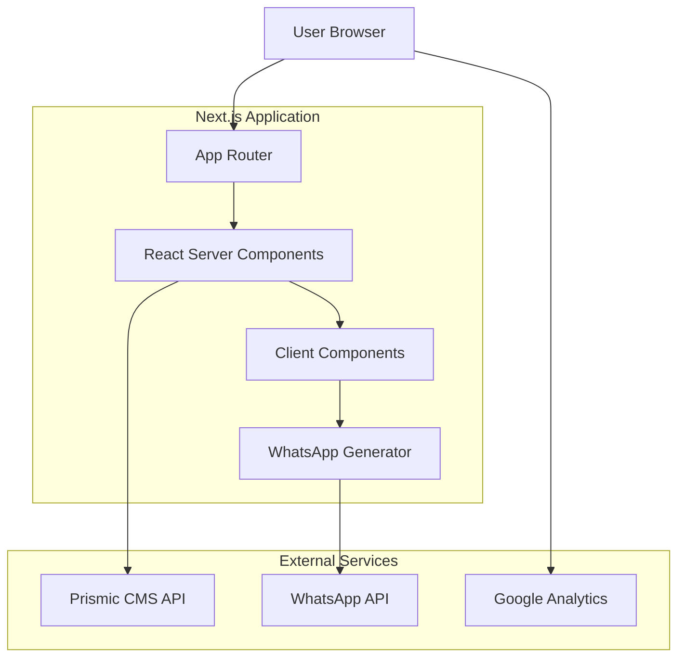

# Technical Specification: Lumia Environmental Consulting Website

## Executive Summary

This document outlines the technical implementation for the Lumia Environmental Consulting institutional website. The solution utilizes **Next.js 14 (App Router)** to deliver a high-performance, SEO-optimized platform that serves as both a brand authority hub and a lead generation tool. Content management will be handled by **Prismic CMS** (`lumia-eng` repository), allowing marketing teams to manage blog posts and case studies independently.

The core architectural strategy focuses on **Static Site Generation (SSG)** with **Incremental Static Regeneration (ISR)** for dynamic content (blog), ensuring top-tier Core Web Vitals. The "Apple iOS" aesthetic will be implemented using **Tailwind CSS** with a custom glassmorphism design system. A key feature is the "Smart Form" system which processes user input client-side to generate structured WhatsApp messages, eliminating the need for backend form storage and prioritizing immediate communication.

## System Architecture

### Component Overview

- **Next.js App Router:** Core application framework handling routing, rendering (RSC), and optimization.
- **Prismic CMS Client:** Handles data fetching for blog posts, authors, and dynamic page content.
- **Design System (UI):** Set of reusable, accessible components (based on Radix UI + Tailwind) implementing the glassmorphism visual style.
- **WhatsApp Integrator:** Utility module to parse form data into valid `wa.me` links with pre-filled messages.
- **Google Analytics 4:** Integrated via `@next/third-parties` for performance and conversion tracking.

### Architecture Diagram



## Implementation Design

### Main Interfaces

#### Contact & WhatsApp Integration

```typescript
// Domain definition for contact form data
export interface IContactFormData {
  name: string
  company?: string
  phone: string // Format: +55...
  intent: 'URGENT' | 'PLANNING' | 'GENERAL' // Maps to "Solve Now" vs "Start Here"
  serviceType?: string // e.g., "Licenciamento", "Multa"
  message?: string
}

// Interface for the WhatsApp link generator service
export interface IWhatsAppService {
  generateLink(data: IContactFormData): string
  formatMessage(data: IContactFormData): string
}
```

#### Content Management (Prismic)

```typescript
// Simplified Prismic Document structure for Blog Posts
export interface IBlogPost {
  uid: string
  data: {
    title: string
    subtitle: string
    main_image: {
      url: string
      alt: string
    }
    content: any[] // Rich Text Structure
    category: 'Licensing' | 'Regularization'
    published_date: string
    author: {
      id: string
      data: {
        name: string
        role: string
        avatar: { url: string }
      }
    }
  }
}
```

### Data Models

Since there is no custom backend database, the "Data Models" refer to CMS content types and client-side state.

1.  **Blog Post (Prismic Type: `blog_post`)**:
    - Fields: Title (Key Text), Summary (Rich Text), Content (Slices), Category (Select), Author (Content Relationship), SEO Title, SEO Description.
2.  **Service Page (Prismic Type: `service_page`)** (Optional, for dynamic service pages):
    - Fields: Service Name, Icon, Hero Image, "How it works" steps, FAQ.
3.  **Config (Env Vars)**:
    - `PRISMIC_REPOSITORY_NAME`: `lumia-eng`
    - `NEXT_PUBLIC_WHATSAPP_NUMBER`: `+5511947305880`
    - `NEXT_PUBLIC_GA_ID`: Google Analytics Measurement ID

### API Endpoints

The application primarily uses Next.js Route Handlers for specific server-side logic if needed (e.g., sitemap generation), but relies mostly on Prismic's client SDK.

- `GET /api/preview`: Prismic preview mode handler.
- `GET /api/exit-preview`: Prismic exit preview handler.
- `POST /api/revalidate`: Webhook endpoint for Prismic to trigger ISR revalidation on content publish.

## Integration Points

### Prismic CMS

- **Library:** `@prismicio/client`, `@prismicio/next`, `@prismicio/react`
- **Auth:** Public API for reads (unless private repo is configured, requires `PRISMIC_ACCESS_TOKEN`).
- **Error Handling:** Try/catch blocks in `getStaticProps` (Page generation time) or `generateMetadata`. Fallback to 404 for missing documents.

### WhatsApp

- **Type:** External Link construction (Protocol Handler).
- **Format:** `https://wa.me/${PHONE}?text=${ENCODED_MESSAGE}`
- **Logic:** Client-side string manipulation. No API key required.

### Google Analytics

- **Library:** `@next/third-parties/google`
- **Integration:** Component-based `<GoogleAnalytics gaId="..." />` in Root Layout.

## Testing Approach

### Unit Tests (Vitest)

- **Components:**
  - `WhatsAppLinkGenerator`: Verify correct string encoding and formatting of message based on `IContactFormData`.
  - `ContactForm`: Test validation rules (Zod schema) for required fields (Phone, Name).
  - `UI Atoms`: Ensure variants (glassmorphism) render correct utility classes.
- **Mocking:** Mock `useRouter` and Prismic client for component tests.

### Integration Tests

- **Flows:**
  - Form Submission: User fills "Solve Now" form -> Clicks Submit -> `window.open` is called with correct WhatsApp URL.
  - Blog Navigation: List page loads -> Click article -> Article detail loads.

## Development Sequencing

### Build Order

1.  **Foundation & Design System Setup**
    - Install Tailwind dependencies (`tailwind-merge`, `clsx`, `tailwind-variants`).
    - Configure `tailwind.config.ts` with brand colors and "glass" utilities.
    - Create base `GlassCard`, `GlassContainer` components.
2.  **Prismic Integration**
    - Setup `@prismicio/*` libraries.
    - Define Custom Types (Post, Category) locally (mock if access pending) or connect to `lumia-eng`.
    - Implement `prismicio.ts` configuration.
3.  **Core Pages Implementation (Static)**
    - `Home`: Hero, Featured Services, Impact Metrics.
    - `Services Hub`: Navigation pages for "Solve Now" vs "Start Here".
    - `About`: Team and Certifications static sections.
4.  **Blog Feature**
    - Blog Listing Page (Pagination, Categorization).
    - Blog Post Detail Page (`[uid]/page.tsx`).
5.  **Smart Contact System**
    - Implement Zod schemas for forms.
    - Build `WhatsAppService` utility.
    - Integrate floating WhatsApp button.
6.  **Optimization & SEO**
    - Implement Metadata API across all pages.
    - Configure `next-sitemap`.
    - Google Analytics setup.

### Technical Dependencies

- **Prismic Repository:** Access to `lumia-eng` required for content modeling.
- **Assets:** High-quality icons/logos for "Success Cases" (placeholder strategy required if not ready).
- **Environment Variables:** `NEXT_PUBLIC_WHATSAPP_NUMBER` setup in Vercel/`.env`.

## Monitoring and Observability

- **Vercel Analytics:** Use Vercel's built-in Web Vitals analytics for performance monitoring (LCP, CLS, FID).
- **Google Analytics:** Track page views, "Click to WhatsApp" events (conversion), and form interaction events.
- **Logging:**
  - **Development:** `console.debug` for Prismic response structures.
  - **Production:** `console.error` for critical rendering failures (captured by Vercel logs).
  - Adhere to `@.cursor/rules/logging.mdc` (no PII logging).

## Technical Considerations

### Key Decisions

- **Glassmorphism via Tailwind Utility Classes:** Instead of heavy CSS assets or libraries, we will use standard Tailwind classes (e.g., `bg-white/10 backdrop-blur-md border-white/20`) composed via `tailwind-variants` for performance and consistency.
- **No Backend Form Storage:** To reduce complexity, maintenance, and privacy risks (GDPR/LGPD), no personal data is stored on our servers. All data is passed directly to the user's WhatsApp client.
- **Route Grouping:** Use of `(marketing)` or similar route groups to organize layout files if the blog layout differs significantly from the landing page.

### Known Risks

- **Prismic API Rate Limits:** Highly unlikely for a static site, but ISR will be configured with reasonable revalidation times (e.g., 60s or on-demand) to avoid over-fetching.
- **WhatsApp API Changes:** The `wa.me` link format is stable but changes could break the "Smart Form" flow. The link generation logic is centralized in one service file for easy updates.
- **Performance with Glassmorphism:** Heavy use of `backdrop-filter` can cause scroll jank on low-end mobile devices. We will use `will-change-transform` sparingly and test on standard mobile viewports.

### Standards Compliance

This specification complies with the following workspace rules:

- **@.cursor/rules/code-standards.mdc**: TypeScript usage, Functional Components.
- **@.cursor/rules/performance.mdc**: Use of Next.js Image, Font optimization, and SSG.
- **@.cursor/rules/project-structure.mdc**: Feature-based or Atomic organization in `src/shared`.
- **@.cursor/rules/error-handling.mdc**: usage of `error.tsx` boundaries.

### Relevant Files

- `src/app/layout.tsx`
- `src/shared/components/forms/ContactForm.tsx` (New)
- `src/lib/prismicio.ts` (New)
- `src/services/whatsapp.ts` (New)
